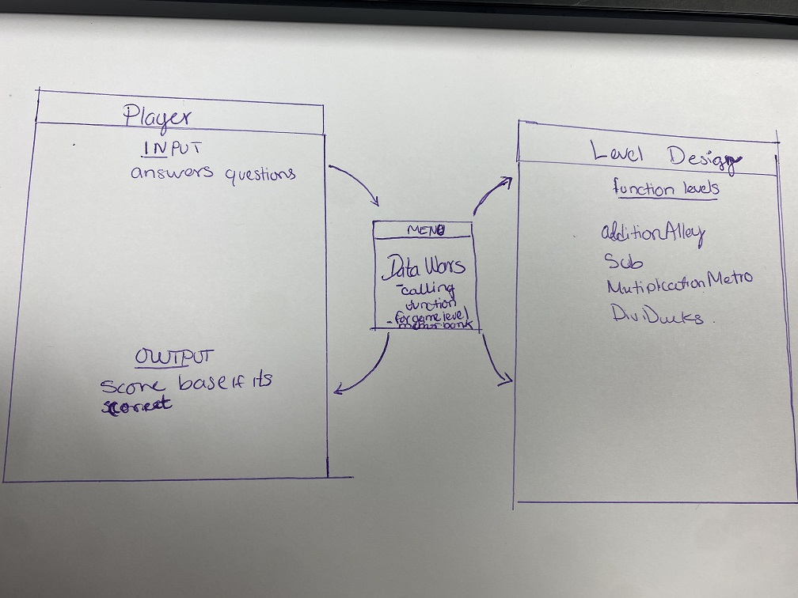

GitHub Pages site


dev blog: https://Grogu-e.github.io/dev-blog

pre-installed GitHub Jekyll Themes: https://pages.github.com/themes/

Website URL: https://grogu-e.github.io/

Here are a list of projects I'm working on:

## Dataman Project

Here are a list of projects I'm working on:
<ul>
  
   <li><strong><a href="https://github/Grogu-e/Grogu-e.github.io>Data Wars</a> - a remake of DataMan as a math games, where numbers are at wars against each other</strong>   </li>

  <li><a href="https://github.com/Grogu-e/CTS285_FA22">Dataman Project</a>- a remake of an 40 year old math game</li>
  
</ul>


## Useful Links

- A list of [Jekyll themes](https://pages.github.com/themes/)
- [GitHub Pages Quickstart](https://pages.github.com)
- [Dev Blog](https://Grogu-e.github.io/dev-blog)
- [GitHub Pages Styling Tips](https://docs.github.com/en/get-started/writing-on-github/getting-started-with-writing-and-formatting-on-github/basic-writing-and-formatting-syntax#quoting-code)
- This Website's URL: https://https://grogu-e.github.io/
## Description
My Main project is DataWars, where a players must solve math problems in different levels in oder to move to the next alley. The numbers are having a wars against odd and evens in addition, subtration, multiplication, and division. 
## User Stories
[Co-Writers Website Kanban Board](https://github.com/users/Grogu-e/projects/3)

## Code Snippets

Here my open Preview button Pyhton Code Snippet
```
#import random 
import time

from addAlley import AdditionAlley
from subSquare import SubtractionSquare
from MultipliMetro import MultiplicationMetro 
from DiviDucks import DivisionDucks


class DataWars_UI:
    def __init__(self):
        
        self.logic = logic.DataWars_Logic()
        self.data = logic.DataWars_Data()
    
   
    
   
    def displayMenu(self):
        
        
        
        
        #Introduction to DATA WARS
        #
        #Let player beging the quest of Data Wars. 
        print("Welcome To Data Wars")
        print("Step 1: Select your avatar ..")
        print("Step 2: Select difficulty")
        print("Step 3: Let the  Data Wars Begin!!")
        
        
        
       

    def menu(self):
        
        QUIT_CHOICE = 5
        choice = 0
        
        while choice != QUIT_CHOICE: 
            
            self.displayMenu()
            
            choice = int(input("Make A Selection: "))
            if choice == 5: # Exit
                return False # UI is finished
            if choice == 1 :
                self.Avatar()
            elif choice == 2 :
                self.Difficulty()
            elif choice == 3 :
                self.Game()
            else:
                print("Please make another selection.")
                return True 
    
        
       
        # print("Welcome To Data Wars")
        # time.sleep(1)
        # self.Avatar()
        # print(f'Your avatar is {avatar}')
        # time.sleep(1)
        # print("2.Memory Bank ")
        # print("3.Number Guesser ")
        # print("5.Exit")
       
    def Avatar(self):
        #avatar selection
        avatars = ['Knight','Wizard', 'Pirate', 'Robot', 'Ninja']
        print('Please choose an avatar')
        for i in range(len(avatars)):
            print(f'{i+1}. {avatars[i]}')
            
            
        avatar_choice = int(input())
        avatar = avatars[avatar_choice -1]
        print(f'You have choosen {avatar}')    

```

## Diagrams


   
